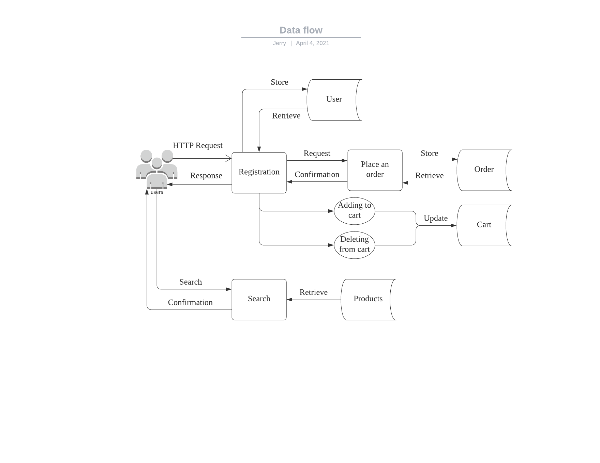
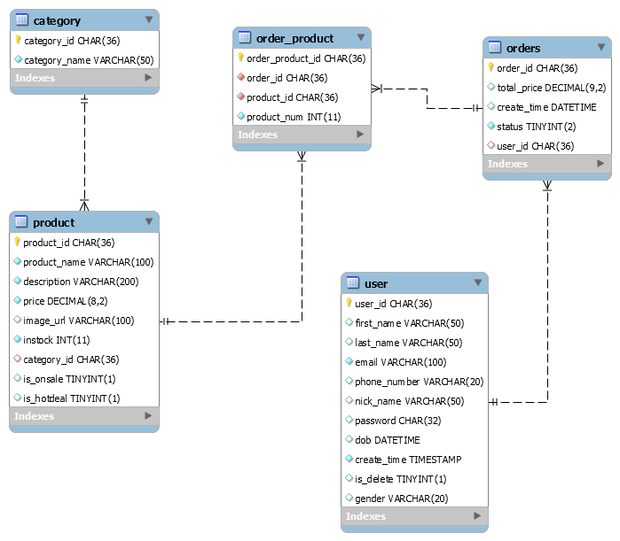

# fullstack-shoppingmall   
**Operating** **System**: Windows 10   
**Development** **Tools**: IntelliJ IDEA, JDK 13, Springboot2, Mybatis, Vue.js   
**Database**: MySQL, MySQL Workbench   
### 1. Introduction
Online shopping is something that most of us take for granted these days, we enjoy the convenience and other benifits of shopping online.
### 2. Objective
The main objective of this phone application is to provide easy assistance to customers.
### 3. Functions/Modules
#### 3.1 Home Page
This page mainly display banner,hot deals and discounted products. 
#### 3.2 Login and Registration
Providing a neatly designed page for the login. The registration module takes the deatils of new user such as name, email, password, etc. the user can access most of the features available in the App after registering successfully.
#### 3.3 Product Category Display
This page display all the main categories of products from this point user can select any category and proceed to choose products in this category.
#### 3.4 Products Details
This module displays the details of selected product, including description,price,image and so on.
#### 3.5 Search
A search bar is provided to all pages except home page, the screen will display all the products under the search criteria. The App will give a message if there are no products found.
### 4. Data Flow Diagram

### 5. EER Diagram

